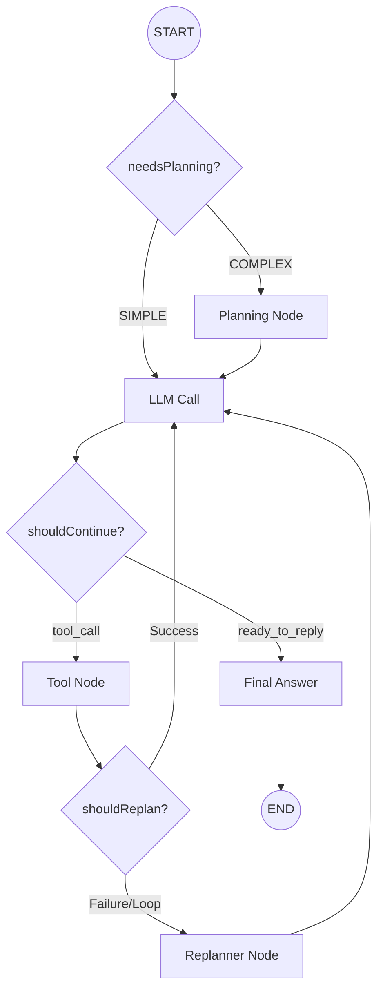

# Welcome to the Agentic AI Project 🤖

This organization hosts the **Agentic AI Platform**, a cutting-edge ecosystem for building, managing, and interacting with autonomous AI agents.

## 🌟 Mission
To democratize access to advanced agentic workflows, enabling developers to build complex, stateful, and tool-using AI applications with ease.

## 🏗️ Core Architecture
Our platform represents a modern microservices approach to AI:
- **Frontend**: React & HeroUI based interactive dashboard.
- **Backend**: A suite of specialized Node.js and Python microservices.
- **Intelligence**: LangGraph-orchestrated agents capable of planning and self-correction.
- **Integration**: Model Context Protocol (MCP) support for extensible tools.

## 🧠 Agent Architecture
Our agents are powered by **LangGraph**, enabling them to plan, execute, research, and self-correct.

## 🚀 Service Ecosystem

| Service | Description | Path |
| :--- | :--- | :--- |
| **Frontend** | React-based interactive dashboard and chat interface. | `ai-agents-frontend` |
| **API Gateway** | Unified entry point handling routing, auth, and proxying. | `backend/api-gateway` |
| **Agent Service** | Core intelligence engine using LangGraph for orchestration. | `backend/agent-service` |
| **Auth Service** | Manages user authentication (OAuth, JWT) and roles. | `backend/auth-service` |
| **User Service** | User profile management and secure file uploads. | `backend/user-service` |
| **LLM Chat Service** | Python service for direct LLM interactions and streaming. | `backend/llm-chat-service` |
| **Chatbot Cards** | Manages conversation history and UI "cards". | `backend/chatbot-cards-service` |
| **Feature Service** | Dynamic feature flag configuration system. | `backend/feature-service` |
| **MCP Client** | Aggregates tools from connected MCP servers. | `backend/mcp-client` |
| **My MCP Server** | Custom MCP server providing tools (Weather, FireTV). | `mcp-server/my-mcp-server` |

---
*Built with ❤️ by the Agentic AI Team.*
